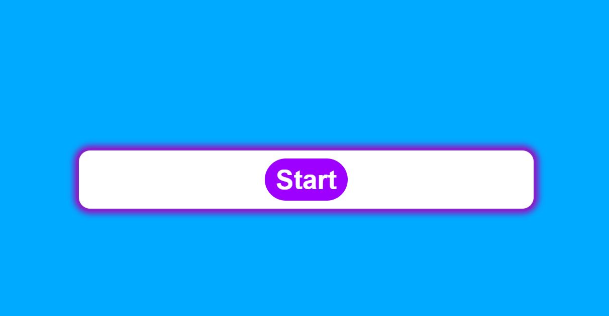
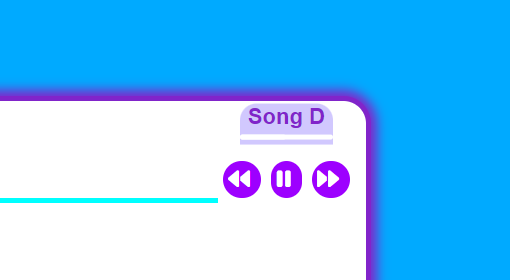
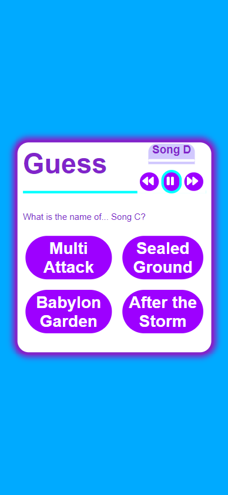
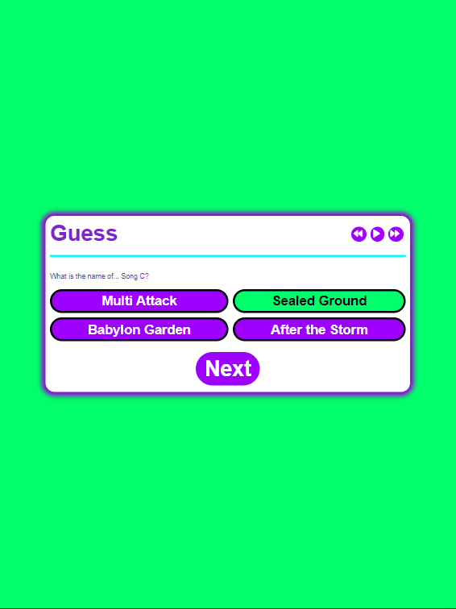
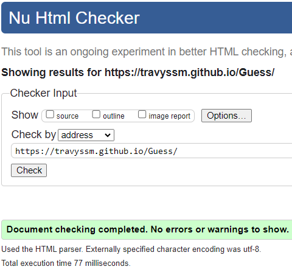
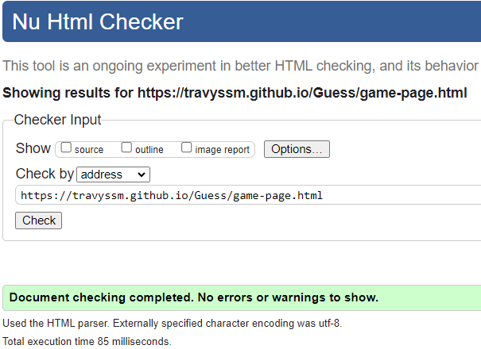
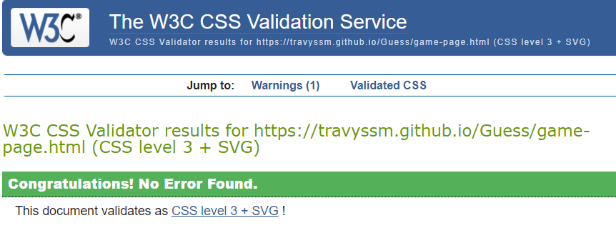
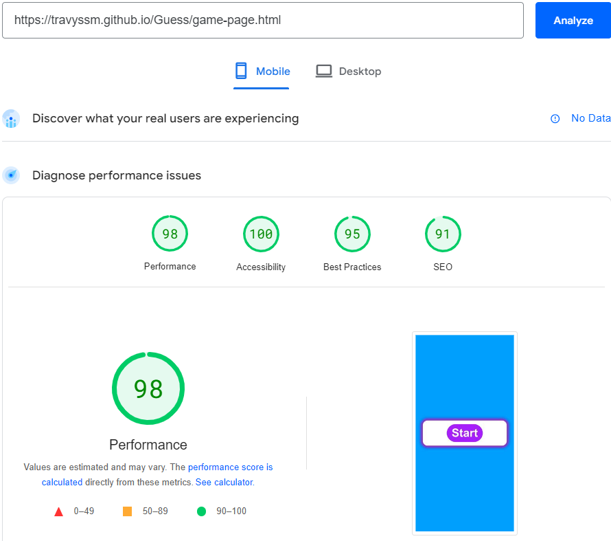
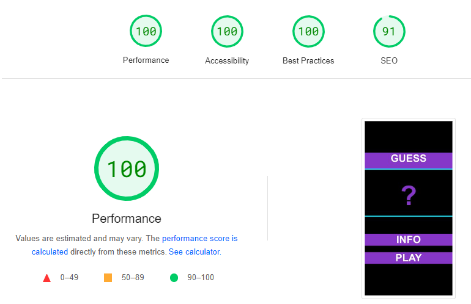

# Guess

Guess is a site that is aimed at people wanting to take a short audio quiz for recreational purposes.

View the site [here](https://travyssm.github.io/Guess/)

## User Experience 

- ### User Stories

- #### First Time Visitor Goals

    1. As a first time visitor, I want to easily understand the main purpose of the site.
    2. As a first time visitor, I want to be able to easily navigate the site.
    3. As a first time visitor, I want to be able to understand how to play the quiz correctly.

- #### Returning Visitor Goals

    1. As a returning visitor, I want to be able to play again as soon as possible.
    2. As a returning visitor, I want to be able to play and pause the song.
    3. As a returning visitor, I want to be able to skip to a different part of the audio.

- #### Frequent Visitor Goals

    1. As a frequent visitor, I would like to see my score at the end of the quiz.
    2. As a frequent visitor, I would like to know which answers I got incorrect.
    3. As a frequent visitor, I would like to test my skills by having a timer.

- ### Design
    - #### Colour Scheme
        - The main colours of the title page are black and purple and a hint of light blue. These were chosen to give a sharp contrast and a serious tone as you begin to play what could be an intense guessing game.
        - The game page however, is mainly light blue accompanied by the earlier purple as well as changing to red and green to represent correct and incorrect answers. This aids in the overall vibrancy and sense of achievement or disappointment when you finally guess an answer.

## Features
### Existing Features

- __Home Page__
    - The home page is where you get access to both the info button and the play button so that you get information on how to play before you start.

    

- __Modal__

    - The modal displays when the info button is clicked, this tells the user the aim of the game and how to play.

- __Game Page__
    - The game page starts out as a second confirmation that you're ready to play and sets up the game area where the quiz will be displayed.

    

- __Media Player__
    - The mini media player allows the user to play the tracks independently, regardless of the question displayed, allowing for a timeless listening session or pausing it on demand.

    

## Testing 

The testing for Guess was done using the Google Chrome Browser and their Chrome Developer Tools to make note of how the site responded when different screen sizes were used. Testing was also done on Microsoft edge and an iPhone XR using Safari to make sure the website renders correctly on different browsers and devices. On using chrome developer tools an error was found where the image wouldnt render correctly on a Galaxy Fold device.

 

### User Stories Testing

1. As a first time user, I want to understand how to play the quiz correctly.
    * The info button on the home page opens up a modal that tells the user what the game is and how to play the quiz using the music player.
2. As a returning visitor, I want to be able to play again as soon as possible.
    * This is made possible by clicking the play again button that displays after the quiz has ended.
3. As a returning visitor, I want to be able to play and pause the song.
    * The music player allows this functionality as well as skipping to certain parts of the track playing.
4. As a frequent visitor, I would like to see my score at the end of the quiz.
    * After the quiz has ended, it will display how many questions you got correct out of the possible number of questions provided.
5. As a frequent visitor, I would like to know which answers I got incorrect.
    * This is implemented whenever you select an answer that is wrong, the display will show red and present you the correct answer in green.

### Validator Testing

- HTML
    - No errors were returned when passing through the official [W3C validator](https://validator.w3.org/)
     

- CSS 
    - no errors were returned when passing through the official [Jigsaw validator](https://jigsaw.w3.org/css-validator/)
    

### Accessibility

- This was checked using the free tool on this [site](https://pagespeed.web.dev/)

 

### Known Bugs

- The game page does not fit as intended when displayed on a screen as small as the galaxy fold device.

## Deployment

The project was deployed to github pages using the following steps:
  
  1. On GitHub, navigate to your site's repository.
  2. Under your repository name, click  *Settings*.
  3. In the left sidebar, click Pages.
  4. Under "GitHub Pages", use the *Branch* drop-down menu and select a publishing source.
  5. Optionally, use the drop-down menu to select a folder for your publishing source.
  6. Click Save.
  7. Once refreshed and successfully deployed, your published site link should be at the top of "Github Pages"

## Credits
* The tracks used for the quiz were sourced from this [Youtube channel](https://www.youtube.com/@DeoxysPrime) and converted into mp3 files.
* The icons for the media player were accessible through [Font awesome](https://fontawesome.com/)
* The quiz layout and coding help were sourced from this [Youtube video](https://www.youtube.com/watch?v=riDzcEQbX6k).
* The music player was created with the aid of this [Youtube video](https://www.youtube.com/watch?v=QTHRWGn_sJw)