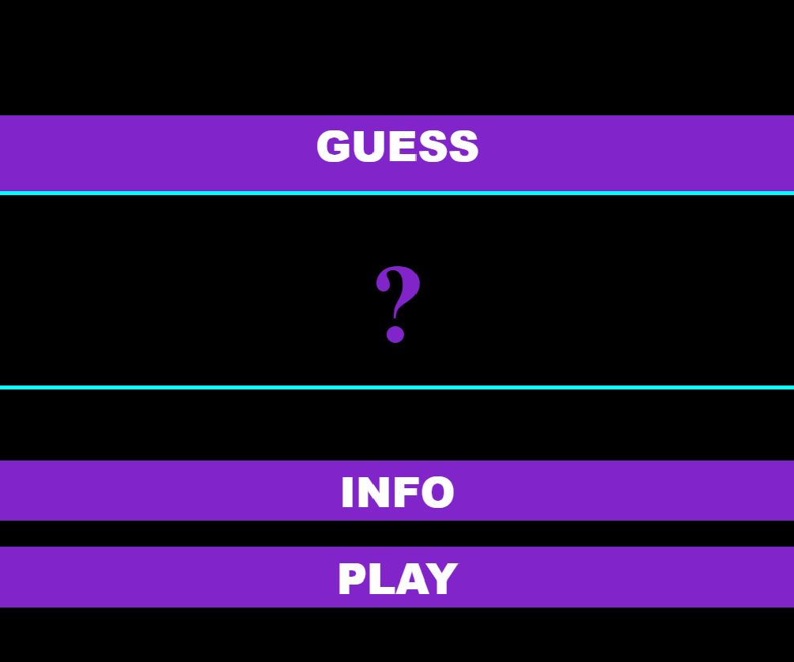
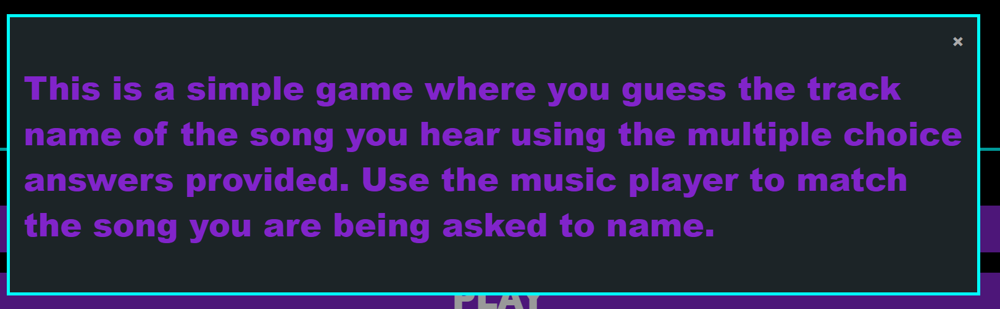

# Guess

Guess is a site that is aimed at people wanting to take a short audio quiz for recreational purposes.

View the site [here](https://travyssm.github.io/Guess/)

## User Experience 

- ### User Stories

- #### First Time Visitor Goals

    1. As a first time visitor, I want to easily understand the main purpose of the site.
    2. As a first time visitor, I want to be able to easily navigate the site.
    3. As a first time visitor, I want to be able to understand how to play the quiz correctly.

- #### Returning Visitor Goals

    1. As a returning visitor, I want to be able to play again as soon as possible.
    2. As a returning visitor, I want to be able to play and pause the song.
    3. As a returning visitor, I want to be able to skip to a different part of the audio.

- #### Frequent Visitor Goals

    1. As a frequent visitor, I would like to see my score at the end of the quiz.
    2. As a frequent visitor, I would like to know which answers I got incorrect.
    3. As a frequent visitor, I would like to test my skills by having a timer.

- ### Design
    - #### Colour Scheme
        - The main colours of the title page are black and purple and a hint of light blue. These were chosen to give a sharp contrast and a serious tone as you begin to play what could be an intense guessing game.
        - The game page however, is mainly light blue accompanied by the earlier purple as well as changing to red and green to represent correct and incorrect answers. This aids in the overall vibrancy and sense of achievement or disappointment when you finally guess an answer.

## Features
### Existing Features

- __Home Page__
    - The home page is where you get access to both the info button and the play button so that you get information on how to play before you start.

    

- __Modal__

- The modal displays when the info button is clicked, this tells the user the aim of the game and how to play.

